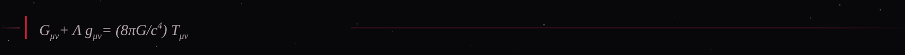
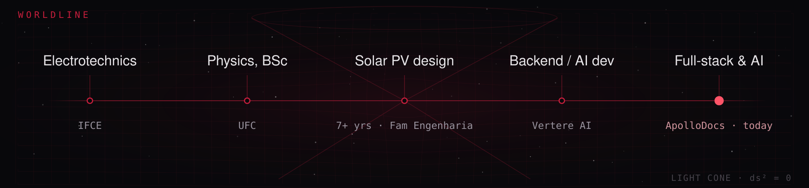
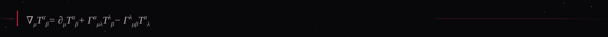
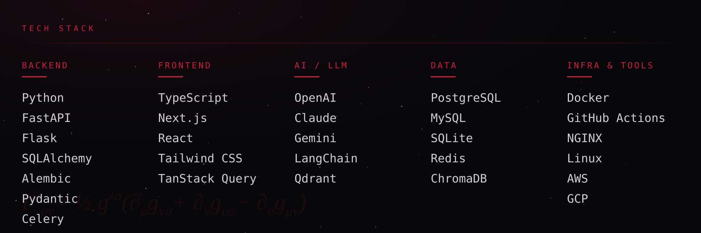
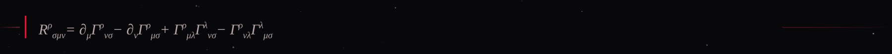
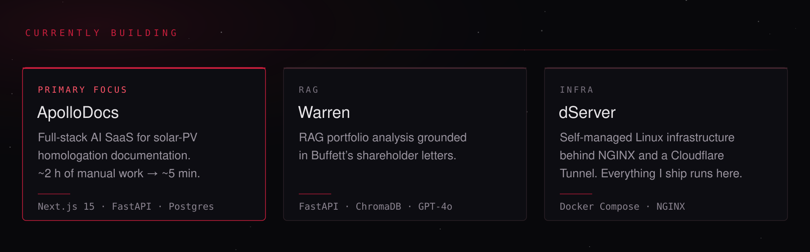

## About

The tensor notation in the banner isn't decoration — it's the General Relativity coursework from my Physics
degree, sitting next to the architecture diagrams from the systems I ship today. Same rigor, different notation.

A tensor doesn't change when you change coordinates; only its components do. Most of what I've built works the
same way — the problem stays the problem, and the basis changes from field work to software.

**Where the pattern shows up:**

- Solar PV designer → repetitive manual documentation → built **Solar-Maker**, a desktop automation tool →
  which became **ApolloDocs**, a full-stack SaaS cutting homologation documentation from ~2 hours to ~5 minutes
- Backend developer at Vertere AI → construction teams needed BIM/IFC quantity lookups without opening Revit →
  built an automated takeoff-extraction pipeline (Celery + ifcopenshell), saving ~30 min per query, and led
  the data-warehouse initiative that feeds an AI agent answering questions about project status
- Personal investing research → built **Warren**, a RAG-grounded portfolio analyzer that reasons over
  Warren Buffett's shareholder letters

## Tech stack

## Featured

| | |
| :--- | :--- |
| **[ApolloDocs](https://github.com/Diaegon)** · full-stack AI SaaS | Solar-PV homologation documents for the ENEL-CE utility. Jinja2 + WeasyPrint PDF generation, PyMuPDF form filling, self-managed infra.   `Next.js 15` `React 19` `TypeScript` `FastAPI` `PostgreSQL 16` |
| **[Warren](https://github.com/Diaegon)** · RAG analysis | Investment analysis grounded in Buffett's shareholder letters.   `FastAPI` `ChromaDB` `GPT-4o` |
| **Vertere Mind** · AI SaaS for construction | AI-powered SaaS for the AEC sector — turns unstructured project data (IFC/BIM models, meeting transcripts, spreadsheets, budgets) into structured, queryable insight. Knowledge-base RAG chat, meeting intelligence, talk-to-your-database SQL agent, BIM quantity extraction, budget intelligence, and multi-provider LLM routing with automatic fallback.   `Flask 3` `PostgreSQL` `Qdrant` `Redis` `Celery` `React` |
| **[Solar-Maker](https://github.com/Diaegon)** · desktop automation | The origin of ApolloDocs — automating the documentation job I was doing by hand.   `Python` |
| **[dServer](https://github.com/Diaegon)** · infrastructure | Self-managed Linux host behind NGINX and Cloudflare Tunnel.   `Docker Compose` `NGINX` `Cloudflare` |

## Currently building

## GitHub

## Get in touch

<code>T'^(i'j'k'l') = A^i'_i A^j'_j A^k'_k A^l'_l T^ijkl</code> — same transformation rules, new basis.

